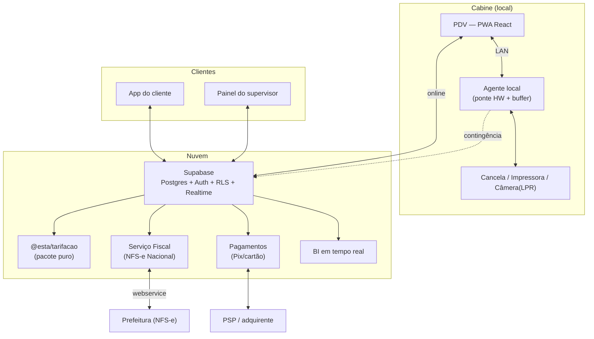

# esta — Análise do Legado e Proposta de Arquitetura

> Documento técnico produzido a partir da **leitura direta dos fontes Clipper**
> (182 arquivos `.PRG`, 94.549 linhas) **e da inspeção dos dados reais** (`.DBF` em
> `filial01.zip`). Substitui as inferências anteriores por fatos verificados no
> código e nos dados. Complementa o `CLAUDE.md`.
>
> Data da análise: 2026-07-24.

---

## 1. Sumário executivo

O legado **HESTA** não é um "controlador de pátio": é um **ERP de operação de
estacionamento** com quatro domínios acoplados — **operacional** (entrada/saída/
tarifação), **fiscal** (RPS → NFS-e, Prefeitura de Campinas-SP), **financeiro**
(contas a receber/pagar/banco) e **fidelidade/CRM**. Está escrito em Clipper/DOS
sobre arquivos DBF, com toda a lógica de negócio embutida em telas
`@ linha,coluna SAY/GET`.

Três conclusões orientam a modernização:

1. **O motor de tarifação foi decodificado e é mais complexo que o documentado.**
   As três regras marcadas `[VALIDAR]` no `CLAUDE.md` agora têm resposta lida no
   código (§4). Ele precisa virar um **pacote puro, testado e reconciliado contra
   histórico real** antes de qualquer outra coisa.

2. **O bloqueio de dados acabou.** Ao contrário do que o `CLAUDE.md` registrava, os
   `.DBF` **existem** — dentro de `hesta3.zip → filial01.zip`. Há **2.575 movimentos
   históricos** em `ESTAMORT.DBF`, suficientes para reconciliar o motor.

3. **O financeiro é código herdado de um sistema escolar** e **não tem ponte
   automática com o operacional.** Modernizar não é "portar": é **reescrever a
   regra de negócio** (mensalista → título a receber) que hoje é manual/externa.

A estratégia continua sendo **Strangler Fig** (migração incremental), começando
pelo núcleo que gera caixa.

---

## 2. O que foi analisado

| Fonte | Conteúdo | Uso nesta análise |
|---|---|---|
| `hesta2.zip` | 182 fontes `.PRG` (94.549 linhas) | Leitura da lógica de negócio |
| `hesta3.zip` | Parametrização + DBFs fiscais + `filial01.zip` | Configuração e dados fiscais |
| `filial01.zip` | **43 `.DBF` operacionais reais** | Modelo de dados e valores reais |
| Foto "COMO FAZER" | Especificação funcional manuscrita | Confirmação do fluxo pretendido |

Leitura direta (não delegada) dos arquivos-núcleo: `SISMENU.PRG`, `ESTALANC.PRG`
(entrada), `ESTALAN2.PRG` (saída/cobrança), `SISPROC2.PRG` (funções `HORAS`,
`PERNOITE`, `MINUTO`). Mapeamento dos demais domínios via varredura estruturada.

---

## 3. Radiografia do legado

### 3.1 Escala e módulos

| Prefixo | Nº fontes | Domínio |
|---|---|---|
| `ESTA*` | 127 | Operação do estacionamento (o grosso) |
| `SIS*` | 15 | Infraestrutura, menu, login, parâmetros, funções |
| `CRC*` | 15 | Contas a receber |
| `CPG*` | 10 | Contas a pagar |
| `BAN*` | 7 | Banco / fluxo de caixa |
| `RPS*` / `ESTARPS*` | — | Fiscal (NFS-e) |

Ponto de entrada: `SISMENU.EXE` (`SISMENU.PRG`). Login `SUPERVISOR` / `clio-`.
Perfis de acesso: **Supervisor (S)** e **Operador (O)** — dois níveis apenas.

**Sistema extremamente parametrizável.** O `SISMENU` carrega **centenas de flags
globais** de `SIS2002.dat`. Um exemplo crítico: a string `pededata` de 14 posições
liga/desliga cada campo do fluxo de entrada/saída (pedir tipo de veículo? pedir
convênio? pedir cartão? imprimir recibo?). O comportamento operacional muda por
instalação **via dados, não via código** — isso precisa virar **configuração por
filial** no modelo novo.

### 3.2 Núcleo operacional — fluxo de entrada/saída

`ESTALANC.PRG` é a tela mestre (lista de veículos no pátio + menu de ações).

**Entrada** (`ESTALANC.PRG:236-919`):
1. Digita a placa → detecta se é **mensalista/hóspede** (`ESTAEMPR`), **sub-placa**
   (`ESTASUBS`) ou **avulso**.
2. Valida se a placa **já está no pátio** (índice impede duplicidade — ao converter,
   vira *constraint* de "no máximo 1 movimento aberto por placa").
3. Para mensalista: checa **vencimento**, **tolerância em dias**, e **restrição de
   horário por turno** (manhã/tarde/noite × dia da semana — máscaras `RESTRM/RESTRT/
   RESTRN` de 7 chars). Fora do horário permitido, é rebaixado a avulso.
4. Atribui **box/vaga** (com *delay* de reuso configurável, `wdelayvaga`).
5. Gera número (cartão ou sequencial `nfiscal`), grava o movimento e **imprime o
   ticket de entrada** (9 layouts possíveis).

**Saída/cobrança** (`ESTALAN2.PRG`) — ver §4.

### 3.3 Motor de tarifação — DECODIFICADO

> Esta é a peça mais crítica. Toda a lógica abaixo foi lida em `ESTALAN2.PRG` e
> `SISPROC2.PRG`. A convenção-chave que muda tudo: **hora comercial `HH.MM`**.

**Convenção de tempo.** Horários são `N5.2` no formato `14.30` = 14h30. A parte
decimal são **minutos (00–59)**, *não* fração de hora. As funções `HORAS()` e
`MINUTO()` (em `SISPROC2.PRG:124,227`) confirmam: converte-se para minutos totais,
subtrai-se, e o resultado volta a `HH.MM`. Um "tempo decorrido" de `2.30` significa
2h30 — e é assim que se compara contra as faixas.

**Estrutura da tabela de preço (`ESTAHORA`, 148 campos):**
- `TIPO` (1 char): código da tabela (`P`=avulso pequeno, `G`=grande, `M`=moto,
  `D`=diária, `V`=valor manual, `1`=nova, etc. — 23 tabelas).
- **Até 45 faixas**: `ATE01..ATE45` (teto de tempo em `HH.MM`), `HOR01..HOR45`
  (valor da faixa), `CON01..CON45` (valor quando a tabela é usada como convênio).
- `PORMINUTO` (S/N): cobrança proporcional por minuto.
- `EPERNOITE`/`SPERNOITE`: janela da diária (ex.: 18h00 → 05h00).
- `VPERNOITE`: valor de cada diária/pernoite.
- `TOL` (`N5.2`): **tolerância percentual** da janela de pernoite (ver abaixo).
- `QTEPONTOS`: pontos de fidelidade concedidos.

**Algoritmo de cobrança (avulso), passo a passo:**
1. `wtempo = HORAS(entrada, saída)` → tempo decorrido em `HH.MM`.
2. `PERNOITE(...)` (`SISPROC2.PRG:153`) devolve um **inteiro empacotado**:
   `nº_diárias × 1.000.000 + tempo_residual × 100`. Ou seja, ele separa quantas
   diárias couberam na estadia e quanto tempo "sobrou" fora da(s) janela(s).
3. Seleciona a faixa: menor `ATEnn` tal que `tempo_residual <= ATEnn`; o valor é
   `HORnn`. Se estourar as 45 faixas, pede valor manual.
4. **Valor = `HORnn` + (nº_diárias × `VPERNOITE`)**.

**As três regras `[VALIDAR]` — resolvidas:**

| Regra `[VALIDAR]` | Conclusão lida no código |
|---|---|
| **Tolerância** era "% ou minutos?" | **Percentual.** Em `PERNOITE()`: `y = (janela_noturna) × (100 − TOL)/100`. Confirmado no dado real: tabela `P` tem `TOL=99.00` (99%). |
| **Pernoite** | Conta-se diária quando o tempo dentro da janela `EPERNOITE→SPERNOITE` ≥ `y`. Cada diária adiciona `VPERNOITE`; o residual cai nas faixas normais. |
| **`usaValorConvenioDaFaixa`** | Quando `conv->TABHORAS="S"`, usa as colunas `CON01..CON15` da própria tabela como valor do convênio (faixa selecionada por `ATE`). |

**Convênios (`ESTACONV`) — várias formas de desconto, aplicadas em cascata:**
- `TABCONV`: usa **outra tabela de preço** para o conveniado.
- `TABHORAS="S"` + colunas `CON`: o convênio tem **sua própria grade de faixas**.
- `PERCONV`: **percentual** sobre o valor.
- `VLRCONV`: **valor fixo**.
- `SELOS`/`VALORSELO` + vales: sistema de **selos/vales** pré-pagos.
- `PEDEHORA`/`PEDECC`: pede hora de corte / centro de custo na saída.

**Cobrança em dois segmentos (achado importante).** Quando o convênio define uma
**hora de corte** (`whoraconv ≠ saída`), o sistema cobra a **tabela do convênio até
o corte** e a **tabela normal do corte até a saída** — somando os dois trechos
(`ESTALAN2.PRG:443-534`). O motor novo precisa suportar isso.

**Outros mecanismos que afetam o valor final:**
- **Saldo devedor** (`VALORDEV`): pagamento parcial fica pendente e é **somado na
  próxima saída** da mesma placa.
- **Fidelidade** (`BONUSFIDE`, `QTEPONTOS`, tabela `ESTAAUTO`): bônus abatido e
  pontos por visita; `ESTAAUTO` é, na prática, um **CRM por placa** (visitas,
  aniversário, endereço completo p/ NFS-e).
- **Forma de pagamento** (`ESTAPGTO.PERCPGTO`): acréscimo/desconto por meio.
- **Piso em zero**: valor negativo é zerado antes de aplicar saldo devedor.

### 3.4 Modelo de dados real (principais DBFs)

| DBF | Registros | Papel | Observações para migração |
|---|---|---|---|
| `ESTALANC` | movimento ativo | **Log central** entrada/saída | **109 campos**; já tem `FILIAL`; split de pagamento `VLRPGTO1/2/3` + `CODPGTO` (3×2 chars); campos fiscais completos; `SERV01..10` |
| `ESTAMORT` | **2.575** | Movimento "morto"/histórico | Alvo da **reconciliação** do motor |
| `ESTAHORA` | 23 | Tabelas de preço (148 campos) | Normalizar as 45 faixas para 1:N |
| `ESTACONV` | 38 | Convênios | Regras de desconto em cascata |
| `ESTAEMPR` | 18 | Mensalistas | 3 placas inline (`VEICULO/1/2`); `VLRMES01..12`; restrições de turno |
| `ESTACAR` | 598 | Modelos de veículo → tabela | Simples (código, carro, tabela) |
| `ESTAPGTO` | 10 | **Formas de pagamento** (data-driven) | Base da conciliação de caixa; **nada hard-coded** |
| `ESTAAUTO` | 18 | Fidelidade / CRM por placa | Vira base do "app do cliente" |

**Concorrência caseira:** cada gravação usa `RECOLOCK`/`SOMARECO` + um contador
`ATUALIZA` para detectar edição simultânea (optimistic locking manual). No mundo
novo, isso é resolvido por **transações Postgres**.

### 3.5 Fiscal (RPS → NFS-e)

- **Município:** Campinas-SP (CEP e códigos fixos no código).
- **Três padrões** selecionáveis por `wtipoarqrps`: **DSF**, **ABRASF** e
  **Padrão Nacional** (SPED/Sefaz, `DPS versao="1.01"`). O Padrão Nacional é o
  futuro (NFS-e nacional unificada) — o alvo do sistema novo.
- **Emissão** acontece no checkout (`ESTADIAC.PRG`): contador global `numeronf` em
  `SIS2002.dat`, com trava de data/hora para impedir emissão fora de ordem.
- **Dados fiscais moram no próprio movimento** (`ESTALANC`/`ESTAMORT`): tomador
  completo, `numnfse`, `numerolote`, `rpsdescr`, `ISS`.
- **Assinatura e transmissão são terceirizadas ao UniNFe (Unimake)** por **troca de
  arquivos XML** (`envio/` ↔ `retorno/`), com *busy-wait* no terminal. O XML é
  montado **string a string dentro de uma DBF** (`TEMPLAY2`), sem parser, sem escape
  de caracteres — frágil.

**Dívida fiscal a resgatar no novo:** parser XML de verdade, assinatura XMLDSig,
integração assíncrona com o webservice, e foco no **Padrão Nacional**.

### 3.6 Financeiro (CRC / CPG / BAN) — herança escolar

> Achado que muda o escopo: **estes módulos foram copiados de um sistema de colégio.**
> Há CNPJ e nome de colégio hard-coded e uma classificação "Aluno/Escolinha/Locação"
> por faixa de número de duplicata (`CRCIMPBN.PRG`). "Locação" = o estacionamento.

- **CRC (a receber, tabela `ASAFITIR`):** geração/baixa de duplicatas, cartas de
  cobrança, **negociação com juros compostos**, promissórias, **importação de
  retorno bancário** (layouts SDF antigos de Banespa/Itaú). Baixa parcial gera
  título residual sufixado com `*`.
- **CPG (a pagar, `LOJDUPP`):** fornecedores, duplicatas, baixa. Esquema mais simples
  e **divergente** do CRC.
- **BAN (banco, `LOJLANC`):** lançamentos, **conciliação** por marcação, saldos
  (`saldo` total e `saldotic` conciliado), centros de custo.

**Não há ponte automática operacional ↔ financeiro.** Nenhum módulo `ESTA*` grava em
contas a receber. Faturamento de mensalista/convênio hoje é feito por **boleto
externo + importação do retorno** ou **lançamento manual**. Regras de negócio
atípicas a validar: **multa multiplicada por nº de dias** e **capitalização composta**
na negociação.

**Implicação:** o financeiro do sistema novo deve ser **reescrito limpo** (sem a
herança escolar), com a **ponte real**: mensalidade e convênio **geram título a
receber automaticamente**; baixa alimenta o fluxo de caixa; boletos via CNAB atual.

### 3.7 Relatórios, fechamento e caixa

- **Fechamento de caixa** (`ESTAFECH.PRG`) opera por **faixa de data/hora e por
  operador/turno** (estado do caixa na tabela `restric`: `fechado`, `numcaixa`,
  janela do turno). Ao fechar, **move** os lançamentos de `ESTALANC` → `ESTAMORT`
  e carimba `numcaixa`.
- **Caixa físico modelado como lançamentos especiais**: abertura ("ENTRADA TROCO",
  `tipomens="-"`) e fechamento ("FINAL TROCO", `tipomens="+"`); diferença de caixa =
  troco inicial + dinheiro − informado.
- **Conciliação** por forma de pagamento lê `CODPGTO` (3×2 chars → até 3 formas) e
  acumula em `ESTAPGTO`. **Dinheiro/débito/crédito/PIX são cadastro**, não código.
- **Tickets/recibos** usam **templates configuráveis** em `TEMPLAY.dbf` com
  placeholders substituídos em runtime (`analisa_variavel()`), impressos via
  spooler externo `pprs`.
- **KPIs que o dono já extrai** (`ESTAFCX.PRG`): volume por categoria, faturamento
  por categoria (valor e "em dinheiro"), tabela × cobrado (descontos), conciliação
  de caixa, menor/maior nota e RPS, tempo médio, alterações por operador. **Todos
  reproduzíveis em tempo real** direto de `ESTALANC`+`ESTAMORT`+`ESTAPGTO`.

### 3.8 Dívidas técnicas transversais

- Lógica de negócio embutida na UI de tela (sem separação domínio/apresentação).
- **Macro-substituição dinâmica** (`&var`, nomes montados em runtime) — inimiga da
  conversão automática.
- Caminhos e dispositivos fixos (`\HESTA\pprs`, pastas de banco, impressora matricial).
- Encoding **CP850** nos dados; sem integridade referencial (relações via
  `SET RELATION` em runtime); numeração sequencial global sob trava de arquivo.

---

## 4. Arquitetura proposta

### 4.1 Princípios

1. **O domínio primeiro, a tela por último.** A regra de negócio (sobretudo a
   tarifação) vive em **pacotes puros, versionados e testados**, independentes de
   UI e de banco.
2. **Strangler Fig.** O novo cresce ao lado do legado, começando pelo núcleo de
   caixa. Nada de "big bang".
3. **Multi-tenant desde o dia 1** (1 filial hoje, SaaS multi-pátio depois), com
   `filial_id` em toda tabela operacional e **RLS** isolando por filial.
4. **Online, com para-quedas local.** PWA sempre online e simples; contingência de
   quedas curtas e ponte de hardware num **agente local na cabine** (decisão do
   Eduardo — "Opção B").
5. **Configuração por dados, não por deploy.** A herança de parametrização do legado
   (o `pededata`, formas de pagamento, tabelas de preço, templates de ticket) vira
   **configuração por filial** editável pelo supervisor.

### 4.2 Stack (confirma as decisões do `CLAUDE.md`)

| Camada | Tecnologia |
|---|---|
| PDV / front-end | React 18 + Vite 5 (PWA) |
| Backend/dados | Supabase (Postgres + Auth + RLS + Realtime) |
| Hospedagem | Vercel (deploy automático no push da `main`) |
| App móvel | PWA responsivo → React Native/Expo se precisar de nativo (LPR/push) |
| Agente de cabine | Serviço local (ponte serial/USB + buffer offline) |
| Testes | `node --test` via `tsx` |

### 4.3 Visão de componentes

### 4.4 Modelo de dados novo (multi-tenant)

Baseado no que os DBFs realmente contêm, normalizado:

- `filiais`, `perfis` (via Supabase Auth), com `filial_do_usuario()` para RLS.
- **Tarifação:** `tabelas_preco` + `tabela_preco_faixas` (1:N, substitui as 45
  colunas planas) + campos de pernoite (`janela_ini`, `janela_fim`, `valor_diaria`,
  `tolerancia_pct`, `por_minuto`, `pontos`).
- `modelos_veiculo` (dos 598 registros), `convenios` (com as formas de desconto em
  cascata), `formas_pagamento` (ex-`ESTAPGTO`, com `perc_ajuste`).
- **Mensalistas:** `mensalistas` + `mensalista_veiculos` (**1:N**, removendo o limite
  de 3 placas) + `mensalidades` (com `vlr_mes_01..12` → linhas) + restrições de turno.
- `vagas` (com *delay* de reuso via `liberavel_em`).
- **`movimentos`**: log *append-only*, índice único garantindo **≤ 1 movimento
  aberto por placa/filial**; guarda decomposição de valor, pagamento (N formas),
  campos fiscais e serviços.
- **Fidelidade:** `clientes` (ex-`ESTAAUTO`, base do app), `pontos`/`visitas`.
- **Fiscal:** `notas_fiscais` (RPS/NFS-e) referenciando o movimento.
- **Financeiro (reescrito):** `titulos_receber`, `titulos_pagar`, `contas_bancarias`,
  `lancamentos_caixa`, `centros_custo` — **com ponte automática** a partir de
  mensalidades/convênios.
- **Caixa:** `caixas` (turno/operador, ex-`restric`), com abertura/sangria/fechamento
  como eventos, não como lançamentos "TROCO" mágicos.

Migrations `0001_core_schema.sql` + `0002_rls.sql` já projetadas — a **aplicar/
verificar** no Supabase (fluxo manual: o Code escreve o SQL, o Eduardo executa).

### 4.5 Motor de tarifação como pacote puro

`packages/tarifacao/` — função pura, sem I/O, replicando **fielmente** §3.3,
incluindo o que o esboço anterior não cobria:
- Convenção `HH.MM` e as primitivas `horas()`, `minuto()`, `pernoite()` (retorno
  empacotado diárias+residual).
- 45 faixas, pernoite (`TOL` percentual), cobrança **em dois segmentos** para
  convênio com hora de corte, saldo devedor, fidelidade, ajuste por forma de
  pagamento, piso em zero.
- **Reconciliação obrigatória** contra os **2.575 movimentos de `ESTAMORT`**: rodar
  cada movimento histórico no motor novo e casar `VALOR`/`VALORCONV`/`VALORPROP`.
  Divergência = bug a corrigir antes de ligar em produção (afeta cobrança real).

### 4.6 Agente local de cabine

- **Ponte de hardware:** cancela, impressora (substitui `pprs`/ESC-P por impressão
  moderna), câmera/LPR — o navegador não acessa serial/USB de forma confiável.
- **Buffer "para-quedas":** fila local de eventos de entrada/saída para quedas
  curtas de internet; sincroniza quando volta. Idempotência por chave de evento.

### 4.7 Fiscal como serviço

- Alvo: **NFS-e Padrão Nacional** (com adaptadores se Campinas ainda exigir
  ABRASF/DSF no período de transição).
- Geração de XML com **biblioteca real + validação de schema + escape correto**,
  **assinatura XMLDSig** própria, transmissão **assíncrona** ao webservice
  (fila/retry/timeout), parsing de retorno com parser XML.
- Numeração de RPS por **sequência transacional no Postgres** (fim das travas de
  arquivo e da emissão fora de ordem).

### 4.8 Financeiro reescrito + BI

- Domínio limpo (sem herança escolar), com **ponte automática**: mensalidade e
  convênio geram **título a receber**; baixa (incl. via **CNAB atual**) alimenta o
  **fluxo de caixa**; conciliação bancária moderna.
- **BI em tempo real** via Supabase Realtime: todos os KPIs do §3.7 calculados
  direto do log de `movimentos` + `formas_pagamento`, sem depender do processo de
  fechamento.

### 4.9 Segurança

- **RLS por filial** em tudo; papéis Supervisor/Operador (+ Cliente para o app).
- Auditoria: manter os campos de operador de entrada/saída/alteração que o legado já
  tinha (`usuarioe`/`usuarios`/`usuarioa`).
- Fluxo Supabase **manual**: o Code **escreve** SQL/migrations e **explica em
  português**; **não executa** — o Eduardo roda no SQL Editor. Cuidado redobrado com
  scripts destrutivos e com o motor de tarifação.

---

## 5. Funcionalidades futuras (aprovadas)

| Funcionalidade | Como encaixa na arquitetura |
|---|---|
| **Pagamento Pix/cartão** | Serviço de pagamentos + `formas_pagamento`; PSP com webhook → baixa automática |
| **App do cliente** | Sobre `clientes`/fidelidade (ex-`ESTAAUTO`); histórico, pontos, pagamento, 2ª via |
| **LPR (reconhecimento de placa)** | Câmera na cabine → agente local → pré-preenche a placa na entrada/saída |
| **Integração com cancela/hardware** | Agente local (ponte serial/USB) |
| **BI em tempo real** | Supabase Realtime sobre o log de movimentos (§4.8) |

---

## 6. Roteiro de migração (Strangler Fig)

**Fase 0 — Fundação (feito/em curso)**
- [ ] Trazer para o repo: schema (`0001`+`0002`), `packages/tarifacao`, protótipo PDV.
- [ ] Aplicar/verificar o schema no Supabase.

**Fase 1 — Motor de tarifação confiável (prioridade máxima)**
- [ ] Portar §3.3 completo para `packages/tarifacao` com testes.
- [ ] **Reconciliar contra os 2.575 movimentos de `ESTAMORT`** (carga em staging,
      encoding CP850) até bater 100%.

**Fase 2 — PDV ligado ao Supabase**
- [ ] Trocar seed por tabelas reais (Auth + RLS). Entrada/saída/tarifação online.
- [ ] CRUDs do núcleo p/ o supervisor (tabelas de preço, convênios, mensalistas,
      formas de pagamento, templates de ticket).

**Fase 3 — Caixa e fechamento**
- [ ] Turno/operador, abertura/sangria/fechamento, conciliação por forma de pagamento.
- [ ] BI em tempo real com os KPIs do §3.7.

**Fase 4 — Fiscal (NFS-e)**
- [ ] Emissão Padrão Nacional (Campinas), assinatura + transmissão assíncrona.

**Fase 5 — Financeiro reescrito**
- [ ] A receber/pagar/banco com ponte automática; boletos CNAB.

**Fase 6 — Futuras**
- [ ] Pix/cartão, app do cliente, LPR, cancela, multi-filial.

---

## 7. Riscos e decisões pendentes

- **Fidelidade** (`ESTAAUTO`/`QTEPONTOS`): confirmar a regra de concessão/uso de
  pontos e bônus antes de portar (impacta o valor cobrado).
- **Formas de pagamento múltiplas** (`CODPGTO` 3×2): garantir que o modelo novo
  suporta **pagamento dividido** (dinheiro + cartão, etc.) desde o PDV.
- **Reajuste de tabelas** (`ESTAHORX`/`ESTAHOR1`/vigência): há vestígios de tabela de
  preço com data de início; confirmar se há **preço com vigência futura**.
- **Financeiro herdado:** validar multa×dias e juros compostos com o Eduardo — são
  regras a **manter, corrigir ou descartar**?
- **Padrão NFS-e:** confirmar com a Prefeitura de Campinas o cronograma
  DSF/ABRASF → Nacional.

---

## 8. Próximos passos imediatos

1. **Trazer os artefatos já produzidos para o repo** (schema, motor, PDV) — hoje o
   repositório só tem `CLAUDE.md`.
2. **Portar o motor de tarifação** com a semântica corrigida deste documento.
3. **Carregar `ESTAMORT` em staging** (CP850 → Postgres) e **reconciliar** o motor.
4. A partir daí, seguir o roteiro (Fase 2 em diante).

> Nada aqui foi commitado/executado automaticamente. Alterações estruturais e
> `git push` dependem de confirmação; SQL é entregue para o Eduardo aplicar.
